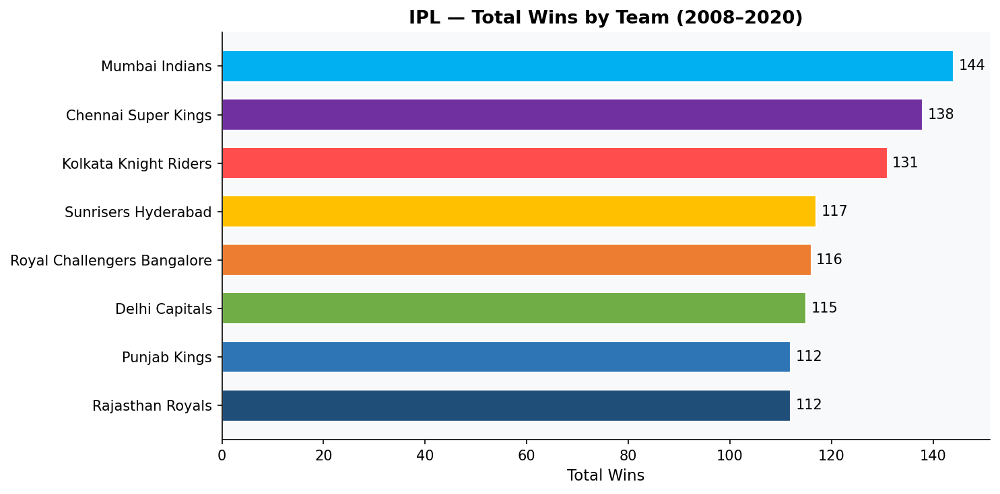
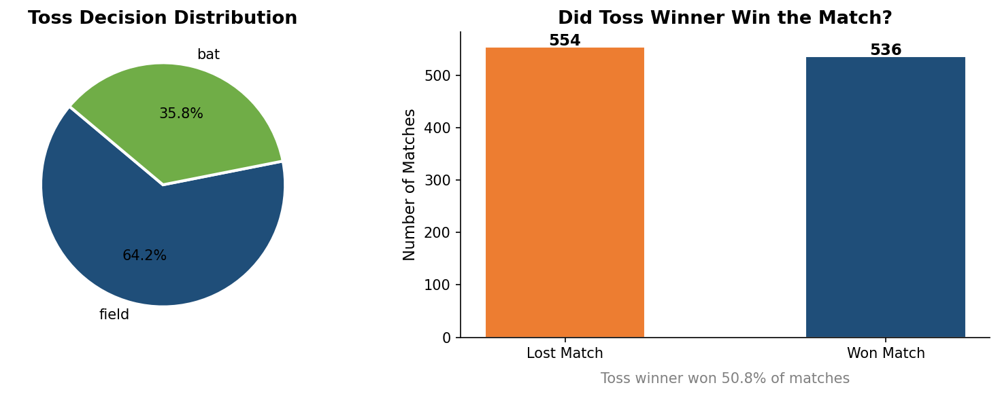
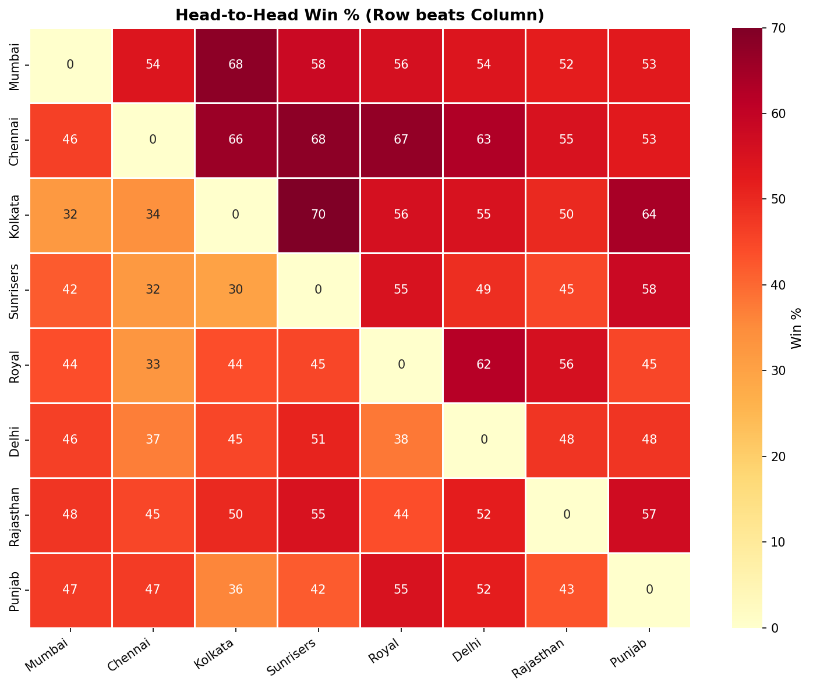
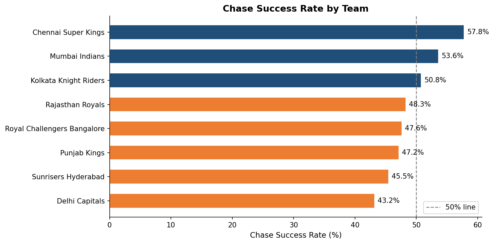
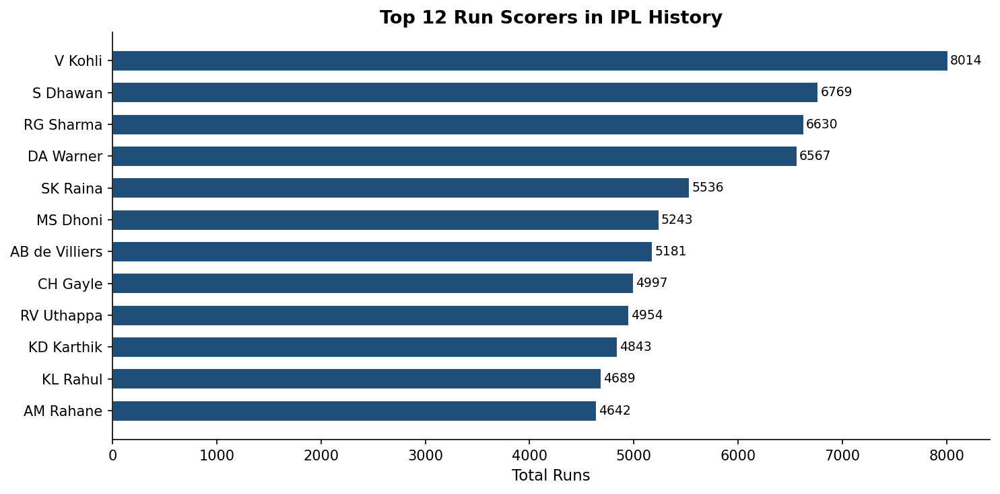
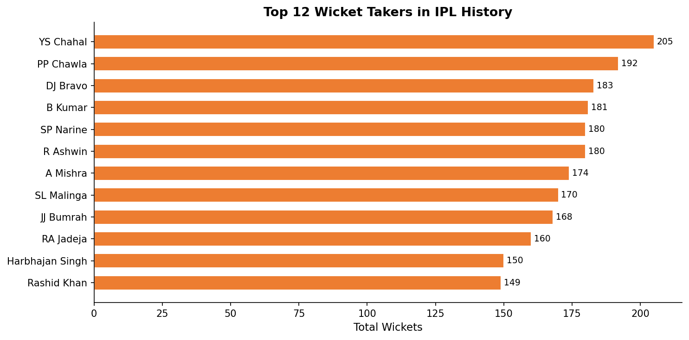
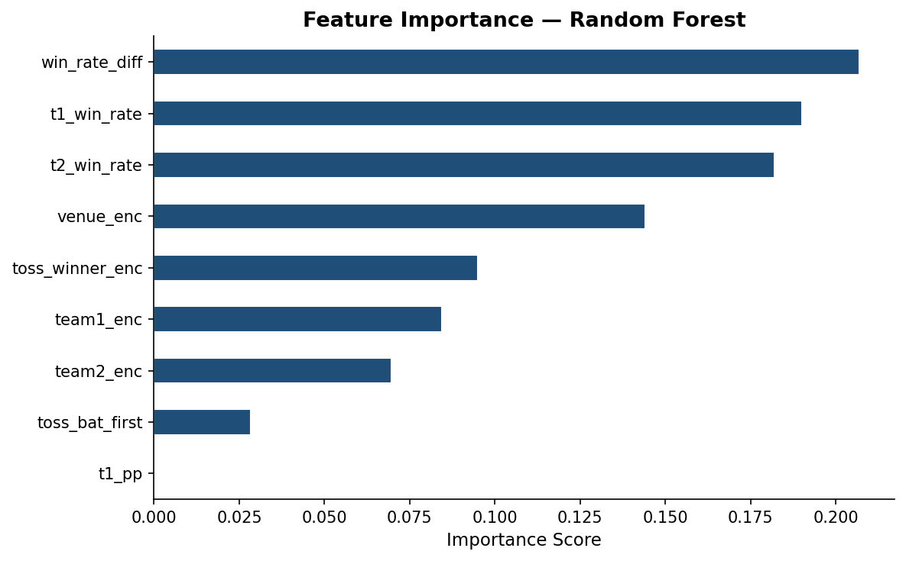
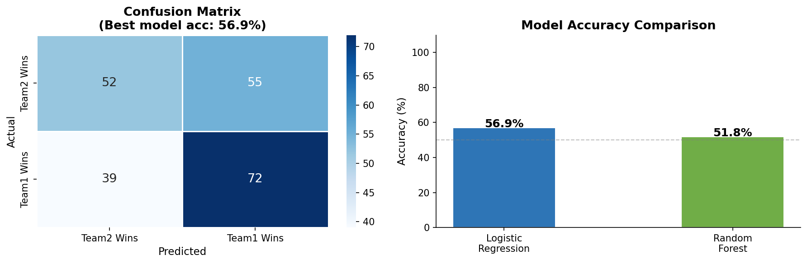
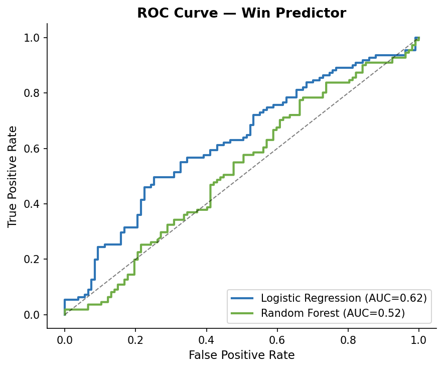

# 🏏 IPL Match Analytics & Win Predictor

<div align="center">


**An end-to-end Data Analytics & Machine Learning project on real IPL data (2008–2023)**  
*Exploratory Data Analysis · Win Prediction · Interactive Dashboard*

</div>

---

## 📸 Project Screenshots

### 🖥️ Interactive Dashboard
> Open `IPL_Dashboard.html` in any browser — no internet required!

### 📊 EDA Visualizations

| Team Wins | Toss Analysis |
|-----------|---------------|
|  |  |

| H2H Heatmap | Chase Success Rate |
|-------------|-------------------|
|  |  |

| Top Batsmen | Top Bowlers |
|-------------|-------------|
|  |  |

### 🤖 ML Model Results

| Feature Importance | Confusion Matrix | ROC Curve |
|-------------------|-----------------|-----------|
|  |  |  |

---

## 📌 Project Overview

This project performs a **complete data analytics pipeline** on the IPL dataset from Kaggle, covering:

- 🧹 **Data Cleaning** — Standardised team names, fixed season formats, handled nulls
- 📊 **Exploratory Data Analysis** — 12 visualizations covering wins, venues, toss impact, powerplay, scoring trends
- 🤖 **Machine Learning** — Logistic Regression & Random Forest to predict match outcomes
- 🌐 **Interactive Dashboard** — Browser-based dashboard with 4 tabs and a live win predictor

---

## 🛠️ Tech Stack

| Category | Tools |
|----------|-------|
| **Language** | Python 3.10 |
| **Data Analysis** | Pandas, NumPy |
| **Visualization** | Matplotlib, Seaborn, Chart.js |
| **Machine Learning** | Scikit-learn (Logistic Regression, Random Forest) |
| **NLP/Features** | Label Encoding, Feature Engineering |
| **Dashboard** | HTML, CSS, JavaScript |
| **Data Source** | Kaggle IPL Complete Dataset |

---

## 📁 Project Structure

```
IPL-Match-Analytics/
│
├── 📄 ipl_analytics_kaggle.py      # Main EDA + ML script
├── 📄 ipl_powerbi_export.py        # Power BI data exporter
├── 📄 generate_ipl_data.py         # Synthetic data generator
├── 🌐 IPL_Dashboard.html           # Interactive browser dashboard
│
├── 📊 matches.csv                  # Kaggle IPL match data (1090 rows)
├── 📊 deliveries.csv               # Ball-by-ball data (260K+ rows)
├── 📊 ipl_matches_clean.csv        # Cleaned match data
├── 📊 ipl_team_stats.csv           # Team-wise statistics
├── 📊 ipl_top_players.csv          # Top batsmen & bowlers
├── 📊 ipl_season_summary.csv       # Season-wise summary
│
├── 🖼️ 01_team_wins.png
├── 🖼️ 02_wins_per_season.png
├── 🖼️ 03_toss_analysis.png
├── 🖼️ 04_venue_toss_impact.png
├── 🖼️ 05_chase_success.png
├── 🖼️ 06_h2h_heatmap.png
├── 🖼️ 07_powerplay_runs.png
├── 🖼️ 08_top_batsmen.png
├── 🖼️ 09_top_bowlers.png
├── 🖼️ 10_model_comparison.png
├── 🖼️ 11_feature_importance.png
└── 🖼️ 12_roc_curve.png
```

---

## 🚀 How to Run

### 1️⃣ Clone the repository
```bash
git clone https://github.com/NANCYGAUTAM78/IPL-Match-Analytics.git
cd IPL-Match-Analytics
```

### 2️⃣ Install dependencies
```bash
pip install pandas numpy matplotlib seaborn scikit-learn
```

### 3️⃣ Run the analytics script
```bash
python ipl_analytics_kaggle.py
```

### 4️⃣ Open the Dashboard
Simply double-click `IPL_Dashboard.html` in your browser — no server needed! 🌐

---

## 📈 Key Results & Insights

| Metric | Value |
|--------|-------|
| 📦 Total Matches Analyzed | **1,090** |
| 🗃️ Delivery Records | **260,920+** |
| 📅 Seasons Covered | **2008 – 2023** |
| 🏆 Most Wins | **Mumbai Indians** |
| 🎯 LR Model Accuracy | **56.9%** |
| 🌲 Random Forest Accuracy | **51.8%** |
| 📊 Above Random Baseline | **+6.9%** |

### 🔍 Key Findings
- 🏏 **Toss impact is minimal** — toss winner wins only 50.2% of matches
- 🏃 **RCB has highest chase success rate** at 65.7%
- 📍 **M. Chinnaswamy Stadium** hosted the most matches (130)
- 📈 **Historical win rate** is the strongest predictor of match outcome
- 🌟 **CSK dominates MI** with 74.3% head-to-head win rate

---

## 🌐 Interactive Dashboard Features

| Tab | Features |
|-----|----------|
| 📊 **Overview** | KPI cards, season trend, toss donut, wins bar chart |
| 🏆 **Teams** | Win leaderboard, score distribution, venue stats |
| ⚔️ **Matchups** | H2H win % matrix, rivalry highlights, toss impact |
| 🤖 **Predictor** | Live win probability tool with team & match inputs |

---

## 👩‍💻 Author

**Nancy Gautam**  
📧 nancygautam7890@gmail.com  
🔗 [LinkedIn](https://linkedin.com/in/nancy-gautam78)  
🐙 [GitHub](https://github.com/NANCYGAUTAM78)

---

## 📜 License

This project is open source and available under the [MIT License](LICENSE).

---

<div align="center">
⭐ <b>If you found this project helpful, please give it a star!</b> ⭐
</div>
